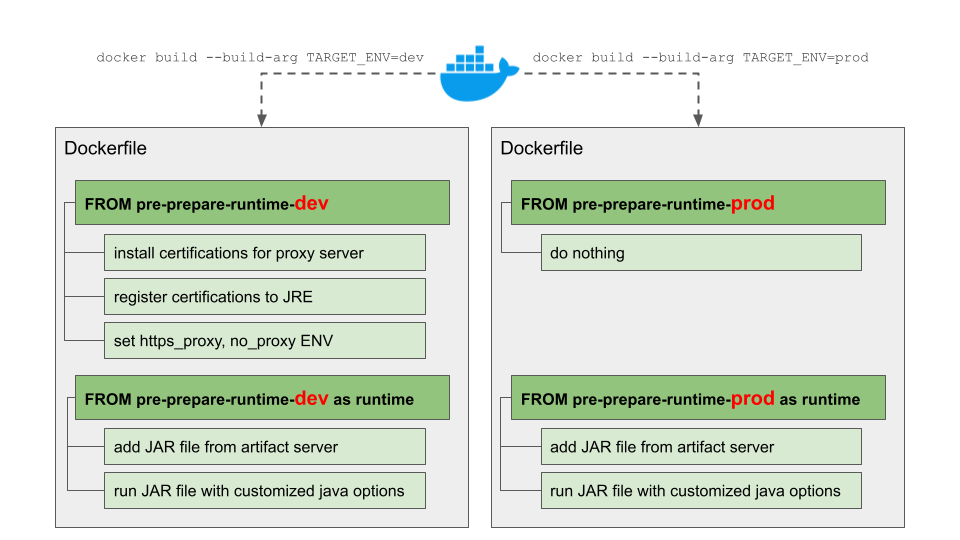

## 배포 환경 별 컨테이너 빌드 분기 처리 방법
사내 서비스 운영 시 사내 프록시 서버 설정을 자동화할 방법을 고민하고 배포 환경 별 컨테이너 빌드 분기 처리를 통해 자동화를 적용한 사례에 대한 기록입니다.

### 목표
사내 개발 환경과 테스트 환경은 기본적으로 인터넷 통신이 되지 않는 폐쇄망 환경입니다.<br/>
그리고 일부망에 한정해 사내 프록시 서버를 통해 인터넷 환경과 통신하며 프록시 서버에는 사내에서 관리되는 서버에 대한 컴플라이언스 정책이 적용되어 있습니다.<br/>
그러다보니 사내망에서 인터넷 통신이 가능하지만 일부 개발자분들은 업무 PC에서 네트워크 통신 설정에 어려움을 겪는 경우도 자주 봤습니다. 그리고 서비스 기능 검증을 위한 사내 테스트 환경도 별도로 설정을 해주지 않으면 외부 API 연동 테스트가 불가능 한 것은 마찬가지였어요.<br/>
최근 외부 API 연동이 필요한 기능 개발하는 과정에서 프록시 설정이 귀찮고 복잡하다보니 사내 테스트 환경에서의 기능 검증을 스킵하고 바로 클라우드 환경인 스테이징에 배포를 요구하는 일들이 종종 발생했습니다.<br/>
데브옵스 입장에서 사내 환경에서의 네트워크 설정(프로시 설정)이 어려워 기능 검증 없이 바로 스테이징에 배포한다라는 상황은 문제라고 생각했습니다.<br/>
왜냐면 지금 상황은 사내 환경에서 프록시 설정의 어려움 때문에 기능 검증을 위한 테스트가 제대로 진행되지 않을 가능성이 높은 상황이고 이는 운영 환경에서의 서비스 기능 버그를 발생시킬 수 있으니까요.<br/>
그래서 사내 테스트 환경에서는 인터넷 연동을 위한 네트워크 설정을 고려햐지 않고 자유롭게 기능을 테스트할 수 있는 방법을 찾아봐야겠다고 생각했습니다.<br/>
고민 결과, 사내 IDC 인프라의 테스트 환경과 퍼블릭 클라우드 기반의 스테이징, 운영 환경을 구분해서 빌드를 나누고 사내 테스트 환경의 배포를 타겟으로 하는 빌드는 서비스 빌드 시 사내 네트워크 설정을 미리 추가해서 개발자 분들이 별도 설정 없이도 기능 테스트가 바로 가능하게끔하는 설정 자동화를 추가했습니다.

### 구현을 위한 여러 고민들
지금 운영 중인 서비스는 쿠버네티스 환경에서 동작하며 컨테이너 기반 빌드를 수행합니다.<br/>
그렇기 때문에 가장 중요한 것은 배포 환경 별로 빌드를 분기 처리하더라도 Dockerfile이 쉽게 관리될 수 있도록 하는 것이었습니다.<br/>
빌드 분기 처리 로직이 추가되었다고 해서 관리를 위한 리소스가 더 많이 소모되면 결국 설정 자동화를 한 것이 또 다른 운영 업무를 추가하는 것이 되어버리니까요.<br/>
처음에는 가장 단순한 구조로 `Dockerfile.dev`, `Dockerfile.prod` 와 같이 파일 자체를 분리하려고 했습니다.<br/>
하지만 가장 단순한 구조로 적용을 한다면 가장 중요하게 생각한 관리 포인트 영역에 위배되는 상황이 발생합니다.<br/>
만약 서비스의 배포 환경이 N개가 되면 N개의 Dockerfile도 관리를 해야하니까요.<br/>
그래서 현재 빌드 경량화를 위한 활용 중인 multi-stage build 방식을 더 잘 활용할 수 있는 방법에 대해서 고민했습니다.

### 구현 방법
여러 고민 끝에 배포 환경을 빌드 시 build-args로 전달 받아서 `dev` 환경과 `prod` 환경을 구분해 빌드를 분기하는 방식으로 설정 자동화 기능을 구현했습니다.<br/>
흔히 알고 있는 multi-stage build 전략은 빌드 시 필요한 여러 단계를 구분해 컨테이너 이미지를 더 경량화할 수 있는 방법입니다.<br/>
가장 쉬운 예제는 빌드 단계에서는 애플리케이션 소스코드를 기반으로 빌드를 수행하고, 배포 단계에서 빌드 단계의 결과물인 실행 파일(jar, exe 등)만 가져와서 구동 환경을 따로 구성하는 예제 입니다.<br/>
기존에 활용되는 multi-stage build 방식과 현재 적용한 사례의 방식을 비교했을 때 가장 큰 차이점은 분기 처리 입니다.<br/>
multi-stage build는 주로 하나의 플로우로 빌드 단계를 위한 명령어, 배포를 위한 명령어가 스테이지를 구분해 차례로 수행되는 구조인데요, 저는 테스트 환경과 프로덕션 환경에 필요한 네트워크 설정이 다르다보니 타겟 배포 환경을 build-args로 전달받고 이에 따라 분기 처리된 명령어들이 따로 수행되도록 했습니다.

간단하게 도식화하면 아래와 같은 그림입니다.



build-args를 통해 `TARGET_ENV`라는 빌드 변수 값을 전달 받아서 `pre-prepare-runtime` 빌드 단계를 통해 `dev` 환경, `prod` 환경 별 스테이지를 분리했습니다.<br/>
사전 준비 단계인 `pre-prepare-$TARGET_ENV`에서 변수 값에 따라 `pre-prepare-runtime-dev` 분기 스테이지에서는 테스트 환경의 복잡한 설정들을 모두 자동화했고 `pre-prepare-runtime-prod` 분기 스테이지에서는 아무 명령어도 수행시키지 않도록 설정했습니다.<br/>
그 뒤에 공통의 런타임 스테이징에서는 서비스의 JAR 파일 구동을 명령어를 순차 실행하게끔 설정했습니다.<br/>
이를 통해 하나의 Dockerfile 안에서도 변수에 따라 분기를 나누고 실행되는 명령어들을 구분할 수 있었습니다.<br/>

아래에는 구현한 Dockerfile의 일부 포맷으로 참고용으로 함께 공유합니다.

```
# TARGET_ENV: dev, prod
ARG TARGET_ENV=dev

FROM amazoncorretto:17-alpine3.18 as base

FROM base as pre-prepare-dev

# install certifications for proxy server
RUN ...

# register certifications to JRE
RUN ...

# set https_proxy, no_proxy ENV
RUN ...

FROM base as pre-prepare-prod

FROM pre-prepare-$TARGET_ENV as runtime

ARG GID=1001
ARG UID=1001

WORKDIR /app

# add JAR file from artifact server
ADD --chown=$GNAME:$UNAME ${JAR_FILE_URL} /app.jar

ENV JAVA_OPTS=""

ENTRYPOINT ["sh", "-c", "java ${JAVA_OPTS} -jar /app/app.jar"]
```
